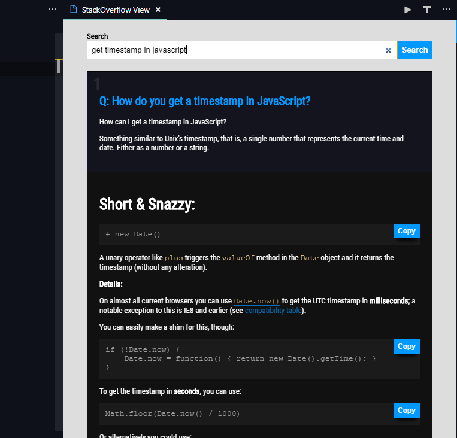

# <i style='color:#09f;background-color:#000;padding:5px 10px;border:1px solid #09f;'>?</i> Integrated Stackoverflow

Get stackoverflow answers right into your text editor and search for solutions easily. 

Just press ***`CTRL + K S`*** to open search bar into your text editor and search for your error

  

<a href="https://marketplace.visualstudio.com/items?itemName=saurabh.integrated-stackoverflow" style="color:#ddd;font-size:10pt;background:#333;padding:10px 14px;border:1px solid #000;">Visit Marketplace</a>

## Usage
Press ***`CTRL + K S`*** to open stackoverflow searchbar, Paste/Type your error and press enter.

## Snapshots

## Contribution
- Check for the issues on https://github.com/saurabhdaware/vscode-integrated-stackoverflow/issues
- Fork the project
- Finish your changes and make Pull Request to Master branch of https://github.com/saurabhdaware/vscode-integrated-stackoverflow

## Local Development
- Fork this project
- `git clone https://github.com/{your username}/vscode-integrated-stackoverflow`
- `cd vscode-integrated-stackoverflow`
- `npm install`
- Open the project in Visual Studio Code and press `Ctrl + f5` to start Extension host.

## Release Notes

### 1.0.x

Initial Release of Integrated Stackoverflow and Minor Updates. 

----

***Dont forget to star my github repository https://github.com/saurabhdaware/vscode-integrated-stackoverflow***

***Enjoy 🎉***